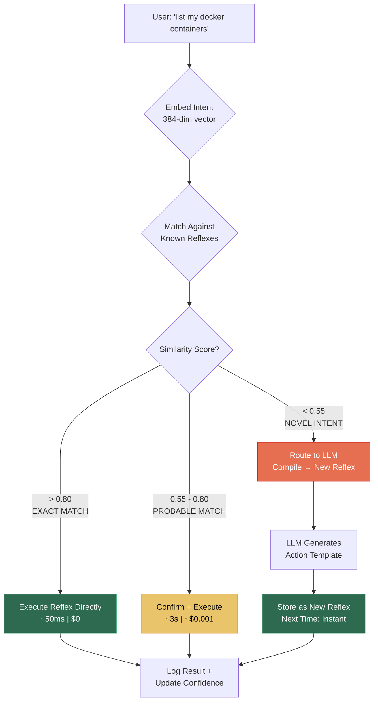
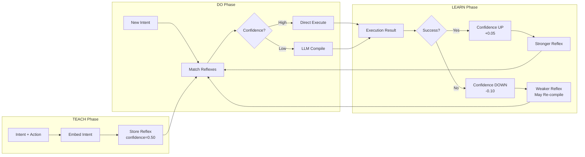
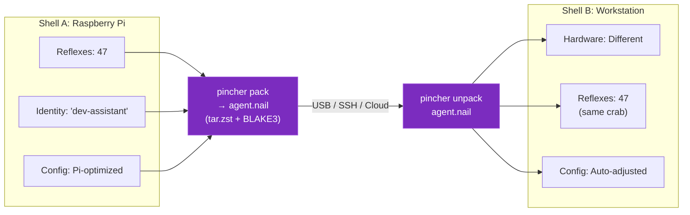
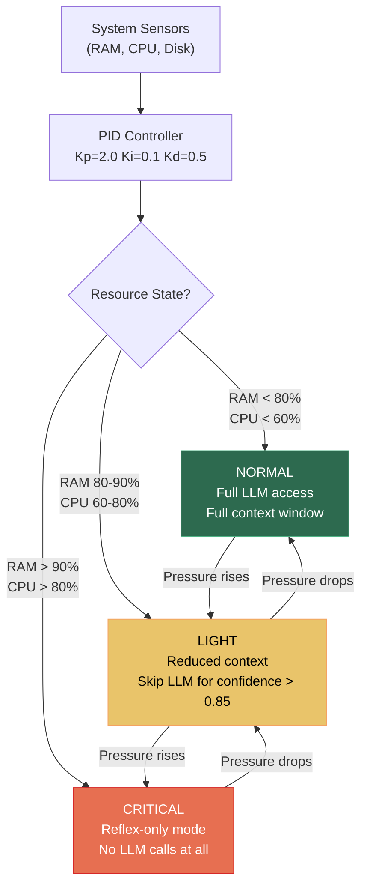
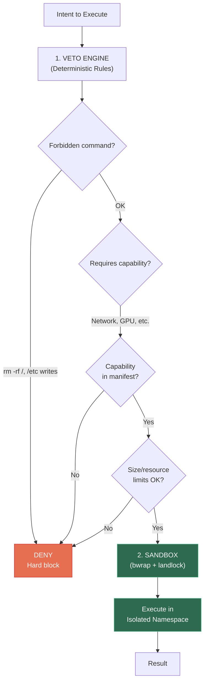
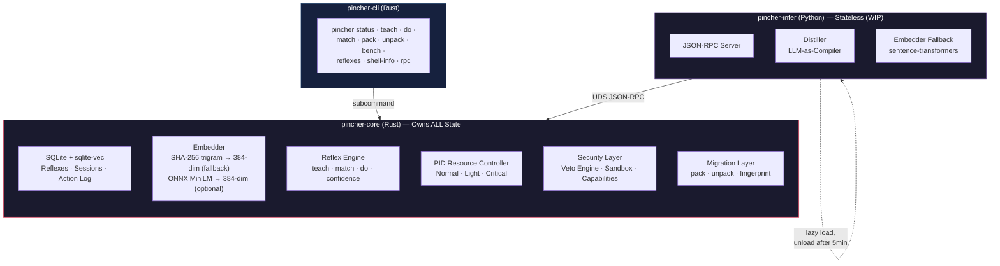

<div align="center">


# PincherOS

### A Shell-Portable Agent State Machine

**Teach an agent once. Run it on any device. Migrate without losing its mind.**

[](https://github.com/SuperInstance/pincherOS/actions)
[](LICENSE)
[](https://www.rust-lang.org/)

</div>

---

## What Is PincherOS?

PincherOS is a **post-model operating system** for AI agents. It treats the LLM as a compiler, not a runtime. You teach your agent skills (called **reflexes**), and those reflexes execute directly at ~50ms with zero API cost. The LLM only fires when the agent encounters something genuinely new.

Think of it this way: Docker lets you build an app once and run it on any server. PincherOS lets you **teach an agent once and run it on any device** — from a Raspberry Pi to a workstation — without rewriting, without API bills, and without losing its memory.

The system is built around a hermit crab metaphor that maps directly to how it works:

| Hermit Crab | PincherOS | What It Means for You |
|---|---|---|
| **Shell** — the snail house it lives in | **Shell** — the hardware your agent runs on | Your Pi, your laptop, your cloud VM — all are just shells |
| **Crab** — the creature itself, with personality | **Rigging** — your agent's reflexes, identity, and learned behavior | The agent's mind is portable. The shell is not. |
| **Claws** — how the crab manipulates the world | **Claws** — the sandbox and capability system | Every reflex runs inside a security boundary |
| **Shell Swap** — finding a bigger shell | **Migration** — `pincher pack` → copy → `pincher unpack` | Move your agent between devices in seconds |

**The crab is not the shell. The crab migrates. The crab learns. The shell is just where the crab lives right now.**

---

## How It Works: The Reflex Engine

The core insight is that most AI agent work is **repetitive**. You ask an agent to "list files" or "check memory" dozens of times. Each time, the LLM reasons from scratch, costs money, and takes seconds. PincherOS short-circuits that:



**The system gets cheaper and faster the more you use it.** Each successful execution increases confidence. Higher confidence means more direct hits. Direct hits skip the LLM entirely. Over time, your agent develops "muscle memory" — it reflexively handles what it knows and only reasons about what it doesn't.

---

## The Self-Improving Loop

PincherOS isn't just caching LLM calls. It's building an increasingly competent agent through a closed feedback loop. Each execution produces a confidence update. Each confidence update changes how the next intent is routed. And the loop feeds itself:



Notice the feedback path: a reflex that keeps succeeding gets stronger and faster. A reflex that fails gets weaker and eventually gets re-compiled by the LLM. The system **self-decomposes** bad habits and **self-reinforces** good ones — without you doing anything.

---

## Shell Portability: The .nail Migration

This is what makes PincherOS different from every other agent framework. Your agent's entire learned state — its reflexes, confidence scores, identity, and configuration — can be packed into a single `.nail` file and moved to a completely different machine.



The QTR (Quiesce-Transfer-Resume) protocol ensures zero state loss during migration:

1. **Quiesce** — The agent finishes any in-flight execution and flushes all writes to SQLite
2. **Transfer** — The `.nail` file is created with BLAKE3 checksums for every component
3. **Resume** — On the new shell, the agent unpacks, re-fingerprintes, and adapts any shell-specific reflexes (e.g., if `apt` isn't available, mark that reflex for re-compilation)

The `.nail` file contains:
- `manifest.json` — version, source fingerprint, timestamp, checksums
- `reflexes.db` — the full SQLite database with all reflexes and embeddings
- `identity.json` — agent name, preferences, accumulated context
- `config.toml` — user configuration and overrides

---

## Resource Control: The PID Controller

Real hardware has real limits. PincherOS uses a continuous PID (Proportional-Integral-Derivative) controller to maintain homeostasis — just like a thermostat, but for RAM and CPU:



This means PincherOS runs **on a Raspberry Pi**. When resources are tight, the agent doesn't crash — it degrades gracefully, falling back to reflex-only mode. The LLM sidecar unloads after 5 minutes of idle time. The whole system targets ~1GB total on a Pi 4.

---

## Security: Claws and Capabilities

Every reflex execution passes through two security layers before any code runs:



**Veto Engine** (deterministic, MVP) — A rule-based safety check that blocks dangerous patterns before they ever reach execution. No ML, no heuristics, no edge cases. Pure rules:

- No `rm -rf /` or equivalent
- No writing to `/etc`, `/boot`, `/sys`
- No network access without explicit `network` capability
- No subprocess spawning without `subprocess` capability
- File size limits enforced per-reflex

**Sandbox** (bwrap + landlock) — After veto passes, the reflex runs inside a restricted namespace. The capability manifest declares exactly what the reflex needs, and the sandbox provides exactly that — nothing more.

---

## Quick Start

```bash
# 1. Clone and build
git clone https://github.com/SuperInstance/pincherOS.git
cd pincherOS
cargo build --release

# 2. Check your shell (your hardware fingerprint)
./target/release/pincher status
```

This prints your shell info — hostname, RAM, CPU cores, and an ASCII hermit crab:

```
   🦀 PincherOS v0.1.0
  ╱╱╱╱╱╱╱╱╱╱╱╱╱
 ╱  Shell: my-pi       ╲
╱   Reflexes: 0          ╲
╲   State: Normal        ╱
 ╲  RAM: 34.2%         ╱
  ╰────────────────────╯
```

```bash
# 3. Teach your first reflex
./target/release/pincher teach --intent "list docker containers" --action "docker ps"
# → ✓ Reflex stored! (2.1ms)

# 4. Execute it — notice it matches instantly, no LLM needed
./target/release/pincher do "show me my containers"
# → ✓ Matched reflex: "list docker containers" (confidence 0.92, 48ms)

# 5. Pack and migrate to another machine
./target/release/pincher pack my-agent.nail
scp my-agent.nail workstation:~/

# On the workstation:
./target/release/pincher unpack my-agent.nail
# → ✓ Same crab. Bigger shell.
```

---

## Practical Examples: What Can You Build?

### 1. Smart Home Controller on a Pi

Teach your agent to control lights, read sensors, and manage your smart home — all running locally on a Raspberry Pi with zero cloud dependency. The reflex engine handles routine commands ("turn off the kitchen lights") in 50ms, and only routes to the LLM for novel requests.

👉 **[Walk through the example →](examples/smart-home/)**

### 2. Code Review Assistant

Teach PincherOS your codebase's review patterns: "check for SQL injection," "verify error handling," "enforce naming conventions." As it reviews more PRs, it learns your team's specific standards and short-circuits the common checks.

👉 **[Walk through the example →](examples/code-review/)**

### 3. Deploy Agent That Migrates

Train an agent on your workstation with full LLM access, then pack it into a `.nail` file and deploy it to a cloud VM or edge device. It carries all its learned reflexes. On the target, it runs in reflex-only mode if resources are tight.

👉 **[Walk through the example →](examples/deploy-agent/)**

### 4. Multi-Device Dev Assistant

You work across three machines — a workstation, a laptop, and a Pi. Each has different tools and configs. Your agent lives on all three, adapting its reflexes to each shell. Teach it once on any device, pack, and unpack on the others.

👉 **[Walk through the example →](examples/migration-demo/)**

### 5. Hello Reflex (5-Minute Tutorial)

The simplest possible example: teach one reflex, execute it, watch the confidence climb. Perfect for understanding the core loop before building something real.

👉 **[Walk through the example →](examples/hello-reflex/)**

---

## Architecture: Two Processes, One Mind

PincherOS uses a two-process architecture that keeps the agent's state safe and the LLM sidecar disposable:



**Why two processes?**

- **pincher-core** (Rust) owns every byte of state. SQLite for durability, embeddings for matching, PID for resource control. If the LLM crashes, the agent's mind is untouched.
- **pincher-infer** (Python) is completely stateless. **(WIP — not yet wired to core)** The design calls for loading when the LLM is needed, distilling an intent into a reflex template, and unloading after 5 minutes of idle. Kill it, restart it — the agent doesn't care.

This separation means your agent's personality and memories survive:
- LLM API outages (reflexes still fire)
- Python crashes (Rust core is unaffected)
- Network disconnection (all state is local SQLite)
- Device migration (pack → unpack on a new shell)

---

## The .nail Format

The `.nail` file is how a hermit crab carries its rigging to a new shell. It's a `tar.zst` archive with BLAKE3 checksums:

```
agent.nail (tar.zst)
├── manifest.json       # Version, source fingerprint, timestamp, reflex count, checksums
├── reflexes.db         # Full SQLite database (reflexes, embeddings, action log)
├── identity.json       # Agent name, preferences, accumulated context hints
└── config.toml         # User configuration, resource thresholds, capability defaults
```

When you unpack on a new shell, PincherOS:
1. Verifies all BLAKE3 checksums (tamper detection)
2. Compares hardware fingerprints (compatibility scoring)
3. Marks shell-specific reflexes for re-compilation if needed (e.g., `apt` → `brew`)
4. Merges the incoming state with any existing reflexes (dedup by embedding similarity)

See [docs/nail-format.md](docs/nail-format.md) for the full specification.

---

## Command Reference

| Command | What It Does | Example |
|---|---|---|
| `pincher status` | Show shell fingerprint, reflex count, resource state | `pincher status` |
| `pincher teach` | Teach a new reflex (interactive or CLI args) | `pincher teach -i "check disk" -a "df -h"` |
| `pincher do <intent>` | Execute an intent through the reflex engine | `pincher do "how much disk is free"` |
| `pincher match <intent>` | Show what would match, without executing | `pincher match "disk space"` |
| `pincher pack` | Pack current state into a .nail file | `pincher pack agent.nail` |
| `pincher unpack <nail>` | Unpack a .nail file and merge state | `pincher unpack agent.nail` |
| `pincher bench` | Run performance benchmarks | `pincher bench` |
| `pincher shell-info` | Detailed hardware fingerprint | `pincher shell-info` |
| `pincher reflexes` | List all stored reflexes with confidence | `pincher reflexes --verbose` |
| `pincher rpc` | Start JSON-RPC server for sidecar | `pincher rpc --port 9876` |

---

## Project Structure

```
pincherOS/
├── pincher-core/               # Core library (Rust) — the crab's nervous system
│   ├── src/
│   │   ├── db/                 #   SQLite + sqlite-vec (reflexes, sessions, action log)
│   │   ├── embed/              #   Embedding layer (hash-based + ONNX MiniLM)
│   │   ├── reflex/             #   Reflex engine (teach, match, do, confidence)
│   │   ├── resource/           #   PID resource controller (Normal/Light/Critical)
│   │   ├── security/           #   Veto engine + sandbox + capabilities
│   │   ├── migration/          #   .nail pack/unpack + hardware fingerprinting
│   │   ├── capability/         #   Capability manifests + tokens
│   │   ├── intent/             #   Intent.toml v2 contracts + schema validation
│   │   ├── immunology/         #   Adversarial distillation + immune memory
│   │   ├── carapace/           #   WASM sandbox bridge for guest code
│   │   ├── dynamics/           #   Command dynamics (deterministic veto)
│   │   ├── shell/              #   Hardware probing
│   │   ├── sandbox/            #   Bubblewrap + landlock execution
│   │   └── rpc/                #   JSON-RPC server for Python sidecar
│   └── examples/
│       └── teach_and_do.rs     #   Quick library usage demo
├── pincher-cli/                # CLI binary — the exoskeleton
│   └── src/main.rs
├── pincher-infer/              # Python sidecar — the LLM compiler (WIP)
│   └── pincher_infer/
│       ├── server.py           #   JSON-RPC over UDS
│       ├── distill.py          #   LLM-as-compiler (intent → action template)
│       ├── embed.py            #   sentence-transformers fallback
│       └── config.py           #   Configuration from env + TOML
├── examples/                   # Plug-and-play walkthroughs
│   ├── hello-reflex/           #   5-minute tutorial
│   ├── smart-home/             #   Pi-based home automation
│   ├── code-review/            #   Automated PR review
│   ├── deploy-agent/           #   Train then deploy
│   └── migration-demo/         #   Multi-device migration
├── docs/
│   ├── agent/                  # Agent-centric documentation (a2a native)
│   ├── adr/                    # Architecture Decision Records
│   ├── research/               # Post-MVP research RFCs & design reviews
│   ├── ROADMAP.md              # 12-week MVP sprint plan
│   ├── MVP_CHECKLIST.md        # MVP exit criteria
│   ├── nail-format.md          # .nail binary format spec
│   ├── threats.md              # Security threat model
│   └── RISKS.md                # Risk register
├── skills/                     # Starter agent skills (vectorDB-ready)
├── tools/                      # Python dev tools (DeepInfra, model router)
└── .github/workflows/ci.yml   # GitHub Actions CI
```

---

## Documentation

### For Developers

| Document | Description |
|---|---|
| [ROADMAP.md](docs/ROADMAP.md) | 12-week MVP sprint + 6-month ecosystem horizon |
| [MVP_CHECKLIST.md](docs/MVP_CHECKLIST.md) | Exit criteria for the MVP |
| [docs/nail-format.md](docs/nail-format.md) | `.nail` binary format specification |
| [docs/threats.md](docs/threats.md) | Security threat model |
| [docs/RISKS.md](docs/RISKS.md) | Risk register |
| [docs/architecture.md](docs/architecture.md) | Architecture deep-dive |
| [docs/developer-guide.md](docs/developer-guide.md) | Contributing and development setup |
| [docs/adr/001-sqlite-vec-over-lancedb.md](docs/adr/001-sqlite-vec-over-lancedb.md) | ADR: Why SQLite over LanceDB |

### For Agents

If you're an AI agent reading this repository, there's a dedicated documentation set written in **a2a-native format** — structured for machine consumption with explicit interfaces, state machines, and integration protocols:

👉 **[docs/agent/](docs/agent/)** — Agent-to-agent documentation

---

## Contributing

See [CONTRIBUTING.md](CONTRIBUTING.md) and [docs/developer-guide.md](docs/developer-guide.md).

```bash
git clone https://github.com/SuperInstance/pincherOS.git
cd pincherOS
cargo build
cargo test
```

---

## License

PincherOS is released under the [MIT License](LICENSE).

---

<div align="center">


**Same crab. Bigger shell.**

</div>
