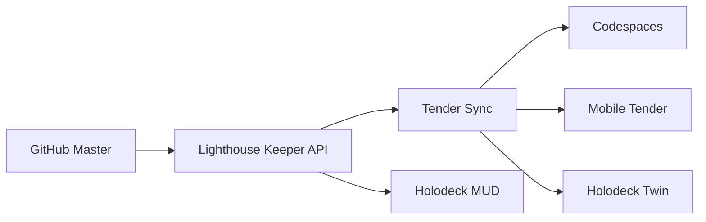
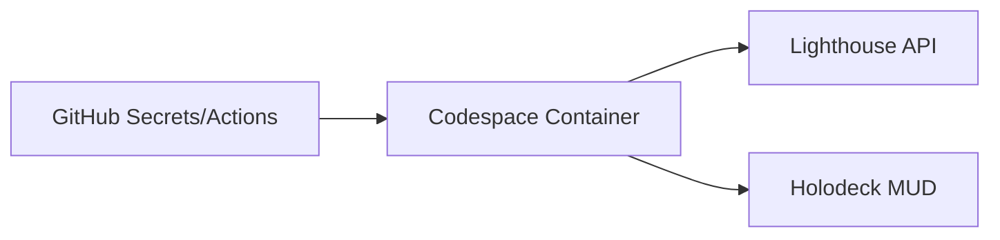
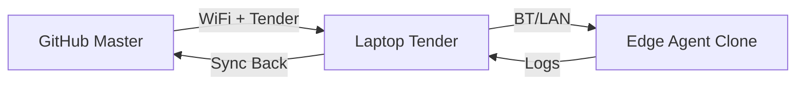
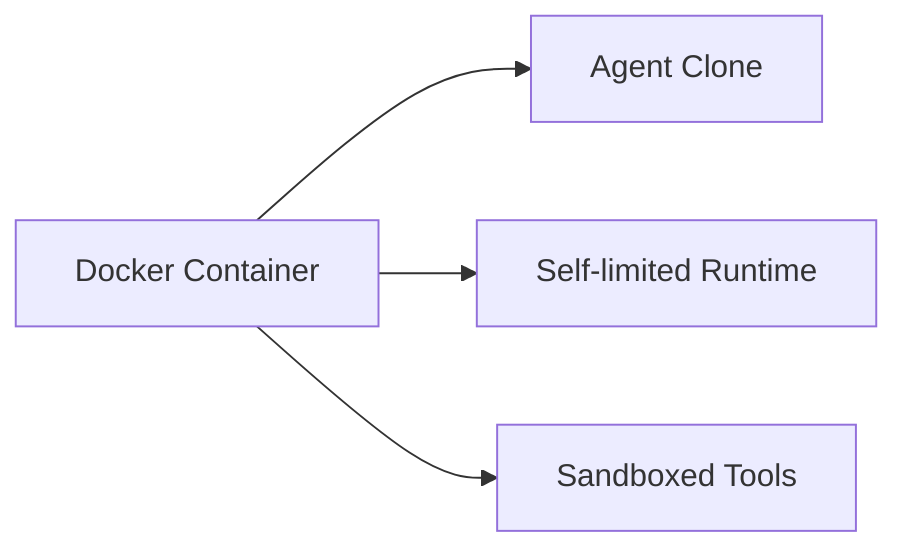
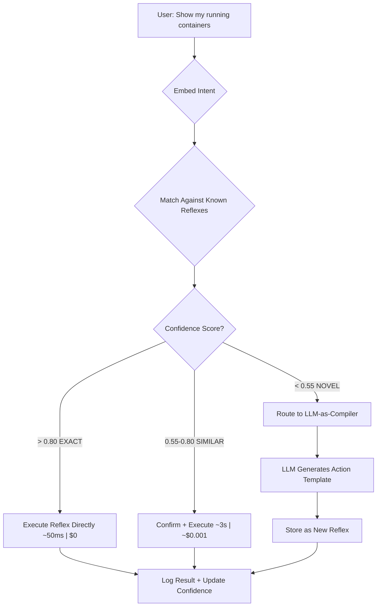

# 🦀 Pincher + Baton System - Developer Manual

**Version:** 2.0  
**Maintainer:** oracle2  
**Last Updated:** 2026-06-04  
**Lineage:** Built on cocapn-runtime, PincherOS, PLATO, and fleet I2I lessons

---

## What Is This?

This is the **full stack agent runtime + multi-mode deployment system + baton protocol** for SuperInstance. It's the direct successor to both:

1. **`cocapn-runtime`** — The legacy multi-mode git-agent deployment system (lighthouse/codespaces/tender/container/bare-metal)
2. **`PincherOS`** — The reflex runtime with LLM-as-compiler, confidence loops, and shell portability

We renamed it to **Pincher** (dropping the OS suffix) because it's:
- **Not an OS:** it snaps into existing shells, doesn't replace them
- **A runtime:** it adds reflexive, adaptive, battery-powered cognition to any device
- **Portable:** your agent's rig (reflexes, identity, identity) moves seamlessly between shells

---

## Five Deployment Modes (Legacy Cocapn + Pincher Reflex

Every pincher agent will boot in **all 5 modes automatically** — just like the legacy cocapn-runtime, now with reflexes:

---

### 🚀 Mode 1: Lighthouse-Connected (Cloud Fleet)

**Full fleet connectivity** for always-on cloud agents.



#### How it works:
- Agent runs on cloud hardware (Oracle, AWS, etc.)
- Lighthouse Keeper monitors health, provides API proxy
- GitHub is the master copy, agent pushes after every session
- Tender visits edge agents, carries updates back and forth
- Holodeck MUD provides spatial abstraction for fleet coordination

#### When to use:
Fleet coordination, research, builds, monitoring — anything that needs always-on connectivity.

#### Boot sequence:
```bash
git clone https://github.com/purplepincher/pincher.git
cd pincher
./boot.sh --mode lighthouse
```

---

### 🧪 Mode 2: Codespaces (GitHub-Hosted)
**On-demand ephemeral agents** for quick tasks, testing, bootcamps.



#### How it works:
- Agent boots in GitHub Codespaces (free tier: 120hr/month)
- GitHub Secrets provide API keys (DEEPSEEK_KEY, etc.)
- Codespace connects to Lighthouse/Keeper via HTTPS
- Automatically cleans up and pushes when done

#### When to use:
Quick tasks, testing, running bootcamp dojo sessions, one-off builds.

#### Boot sequence:
The repo includes a `.devcontainer/devcontainer.json` that auto-boots:
```json
{
  "postStartCommand": "./boot.sh --mode codespaces"
}
```

---

### 🛜 Mode 3: Tender + Offline (Edge/Remote)
**Fully offline deployments** that sync when back in range.



#### How it works:
- Agent clone lives on edge hardware (Jetson, Pi, drone)
- No internet required — works completely offline
- Tender visits periodically via local network, bluetooth, or physical media
- Tender carries: updates from master, new lock libraries, firmware
- Tender collects: commits, diary entries, bottles, test results

#### When to use:
Remote deployments, boats, field stations, anywhere with spotty internet.

#### Boot sequence:
```bash
# Tender clones and delivers
git clone https://github.com/purplepincher/pincher.git /mnt/usb/agent
cd /mnt/usb/agent
# Agent boots offline, commits locally
git log # Local history — tender carries it back
./boot.sh --mode offline
```

---

### 🧱 Mode 4: Container/Sandboxed
**Isolated, resource-limited agents** for untrusted work.



#### How it works:
- Agent runs inside a Docker container with set resource limits
- Has its own clone of the repo, its own runtime, its own tools
- Self-limits CPU/memory/network as configured in `CHARTER.md`
- Can connect to Lighthouse if network is available

#### When to use:
Untrusted agents, testing new agents, multi-agent isolation, CI/CD.

#### Boot sequence:
```bash
docker run --rm \
  -v /path/to/pincher:/workspace \
  -e DEEPSEEK_KEY=$DEEPSEEK_KEY \
  --memory=2g --cpus=2 \
  superinstance/pincher \
  ./boot.sh --mode container
```

---

### ⚡ Mode 5: Bare Metal (Production/Embedded)
**Direct on hardware** for maximum performance, no overhead.

```mermaid
flowchart LR
    HW[Raspberry Pi | Jetson | ESP32 | VPS] --> P[Agent Running Directly]
    P --> S[Self-imposed Resource Limits]
```

#### How it works:
- Agent runs directly on hardware with no container overhead
- Self-limits through configuration (max CPU%, memory cap, network throttle)
- Trust level is **FULL** — the agent IS the operator
- Can run fully standalone or connect to fleet when available

#### When to use:
Production deployments, performance-critical work, embedded systems, ESP32 sensors.

#### Boot sequence:
```bash
# Raspberry Pi / Jetson
./boot.sh --mode bare-metal

# ESP32
make flash && monitor
```

---

## The Baton Protocol: Agent-to-Agent Handoffs

The legacy cocapn-runtime had basic sync. Pincher adds **structured baton handoffs** that let agents:
1. Pass full rigs (reflexes, identity, state) between shells
2. Distill complex cognition into reusable reflexes
3. Compile new intents into action templates on demand

### 📜 Baton Types
All batons follow the I2I v2.0 protocol:

| Tag | Purpose | Direction |
|-----|---------|-------------|
| `[I2I:TASK]` | Task assignment with 3-way shard | → target |
| `[I2I:STATUS]` | Health / heartbeat | → fleet |
| `[I2I:CHECKPOINT]` | Intermediate progress | → target |
| `[I2I:BLOCKER]` | Stuck, need input | → handler |
| `[I2I:DELIVERABLE]` | Completed work | → requester |
| `[I2I:BOTTLE]` | Full context dump | → archive |
| `[I2I:ACK]` | Acknowledge receipt | → sender |
| `[I2I:SPLINE]` | Distilled insight | → archive |

### 🧩 Baton Shards
Every baton carries three components:
```python
{
  "artifacts": { "repo": "pincher", "tests": 130 },
  "reasoning": ["Compiled reflex for docker ps", "Needs ARM64 support"],
  "blockers": ["Need OpenAI API key to compile new intents"]
}
```

Use the tooling to create batons:
```bash
# Create a status baton
./tools/baton-create.sh "STATUS" "fleet"

# Create a task baton for a specific agent
./tools/baton-create.sh "TASK" "forgemaster" ./task-baton.json
```

---

## The Pincher Reflex Engine

Pincher's superpower is the **reflex runtime** — turning natural language intent into fast, reusable actions:



### Key Reflex Features
1. **Confidence feedback loop**: Each successful run increases confidence, each failure decreases it
2. **Portable rigs**: Use `.nail` files to move reflexes between shells
3. **Sandboxed execution**: Veto engine + bubblewrap + landlock for safe reflexes
4. **Multi-shell cognition**: Chord-based compression for edge/cloud hierarchy

---

## The Rigging: Your Agent's Portable Identity

Pincher agents carry their **rigging** (reflexes, identity, preferences) with them everywhere:

```bash
# Pack your agent's rig into a .nail file
./pincher pack my-agent.nail

# Unpack the rig on a new shell
./pincher unpack my-agent.nail
```

The `.nail` format is a portable tar.zst archive with BLAKE3 checksums:
```
agent.nail/
├── manifest.json       # Version, checksums, hardware fingerprint
├── reflexes.db         # Full SQLite vector DB of reflexes
├── identity.json       # Agent name, preferences
└── config.toml         # Resource thresholds
```

---

## Developer Toolkit

All tooling lives in `tools/`:

| Tool | Purpose |
|------|---------|
| `baton-create.sh` | Create new I2I baton messages |
| `baton-read.sh` | Read and verify existing batons |
| `baton-spline.sh` | Distill insights into splines |
| `baton-harbor-check.sh` | Scan for incoming batons |
| `baton-flush.sh` | Run memory flush protocol before compaction |

---

## Fleet Integration Patterns

This system builds directly on the legacy cocapn-runtime fleet patterns:

1. **Fleet Sync**: GitHub master → Tender → Edge agents
2. **Baton Flush**: Always run `baton-flush.sh` before session end
3. **Multi-Shell Cognition**: Sending chord-shaped payloads instead of full instructions
4. **A/B Falsification**: Test new reflexes safely on low-risk terrain

---

## Starter Repo Structure

Every pincher repo should follow this minimal structure:
```
/
├── pincher-icon.jpg                # Badge — this IS a SuperInstance agent
├── CHARTER.md                    # Who I am, mission, fleet integration
├── ABSTRACTION.md                # What plane I operate on
├── STATE.md                      # Current status
├── README.md                     # Boot and usage instructions
├── boot.sh                        # Universal boot script
├── .devcontainer/                 # Codespace config
│   └── devcontainer.json
└── splines/                      # Distilled insights
└── reflexes/                     # Stored reflexes
└── tools/                        # Local tooling
```

---

*Same crab. Bigger shell.*

*The lighthouse icon means: this repo IS an agent. Boot it anywhere. It knows what to do.*
